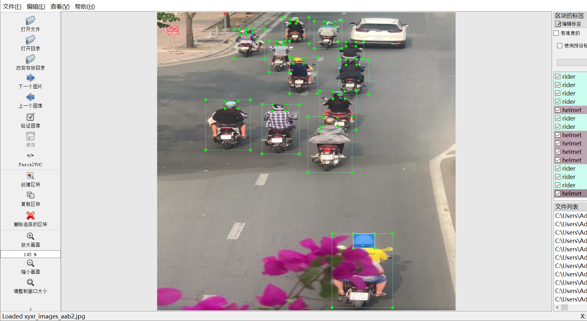
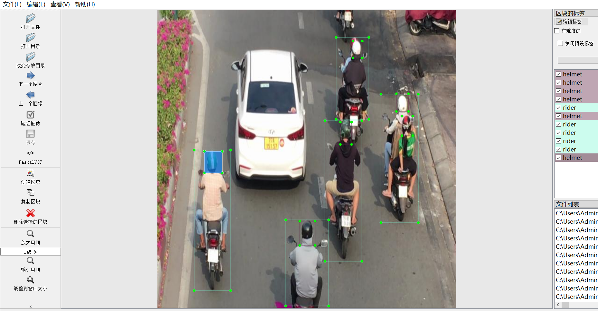
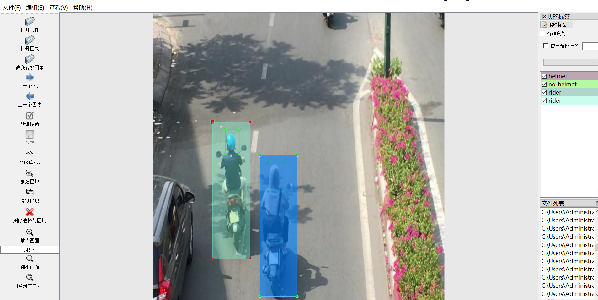
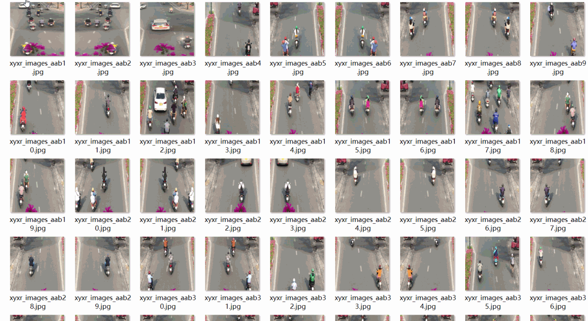

# [Object Detection] City Street Fixed CAMERA Captured Ride Electric Motion Vehicle Belt Helmet Detection Dataset 2060 images3-classLabels YOLO+VOC format

【Object Detection】City Street Fixed Camera Shooting Driving Electric Vehicles with Helmets Dataset 2060 Images 3-class label YOLO+VOC format

Dataset Format: VOC format + YOLO format

The compressed file contains: three folders, each storing images, xml files, and text files.

Total jpg images in JPEGImages folder: 2060

The total number of XML files in the Annotations folder: 2060

The total number of txt files in the labels folder is 2060.

Number of tag types: 3

Tag names: ["helmet","no-helmet","rider"]

The number of boxes for each label (Note that the order of labels in the Yolo format does not correspond to this, but is based on the classes.txt file in the labels folder):

helmet frame count = 9086

no-helmet frame count = 438

rider frame count = 8674

Total boxes: 18198

Picture clarity (Resolution: Pixels): Clear

Is the image enhanced: No

Shape of the label: Rectangular box, used for object detection and recognition.

Dataset Type ：80m

Special Notice: This dataset does not guarantee the accuracy or precision of the trained models or weight files. The dataset only provides accurate and reasonable annotations.

Picture overview

## Images

---

Here is a pay link on Stripe (https://buy.stripe.com/3cs8yP7sY87d0vu9AB). Please contact me lonlonago@foxmail.com after funding $89, and I will send you a complete data files, thank you!

